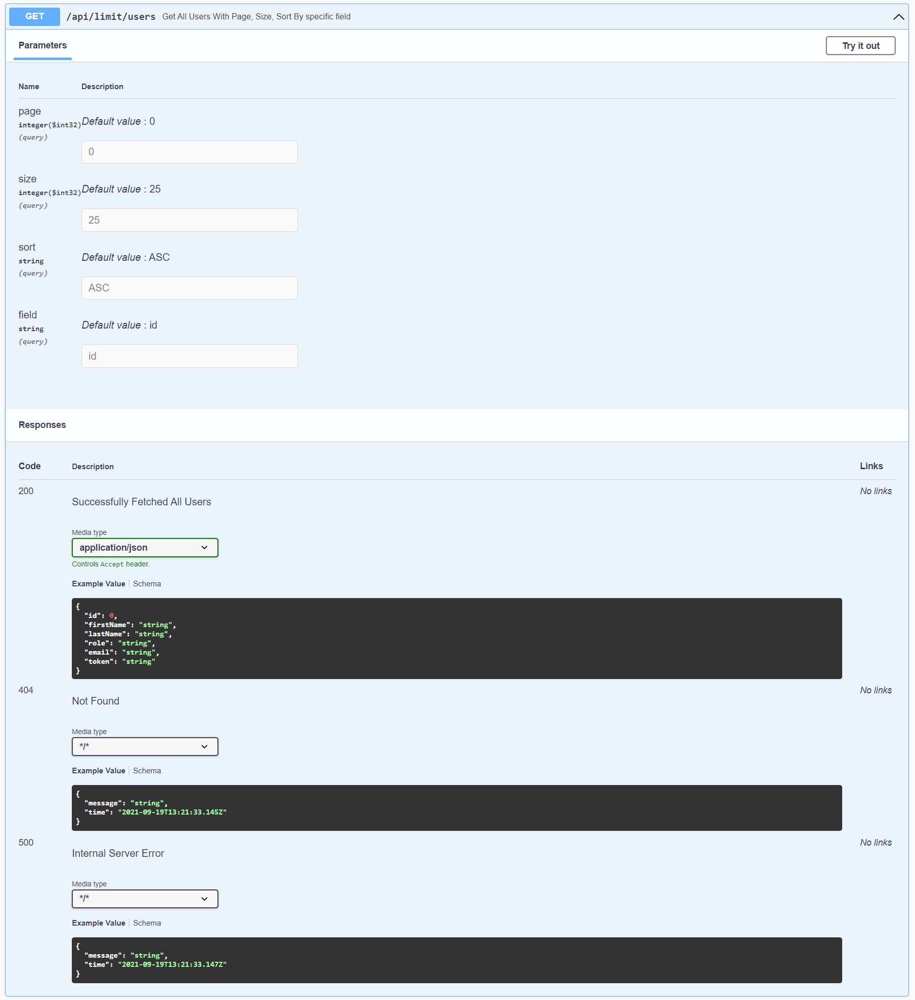

# Spring Boot Swagger
#### Source :
- [Baledung](https://www.baeldung.com/spring-rest-openapi-documentation)
- [Open API](https://springdoc.org/)

### **Controller**

### **Delete User By Id**

### **Get All Users**

### **Get User By Id**

### **Get User With Page, Size, Sort by field**

### **Create User**

### **Update User**

### **Schemas**
